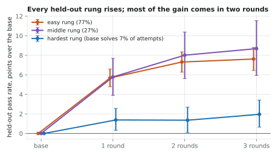
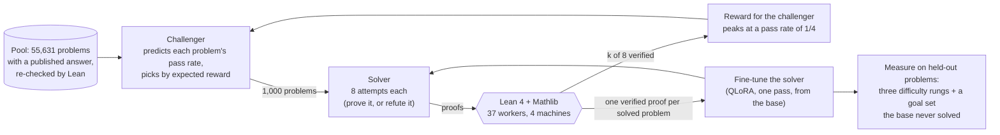
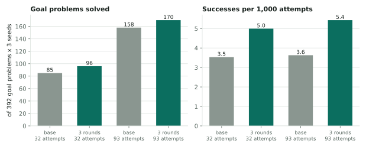
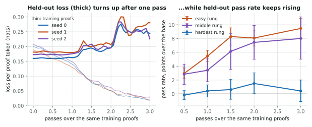
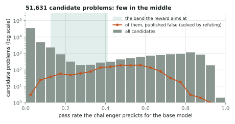
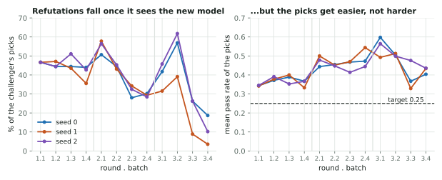
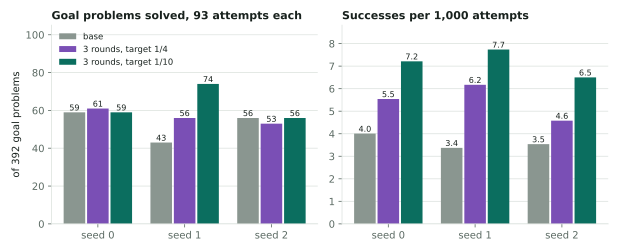
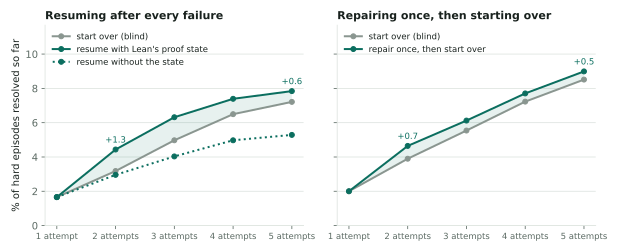
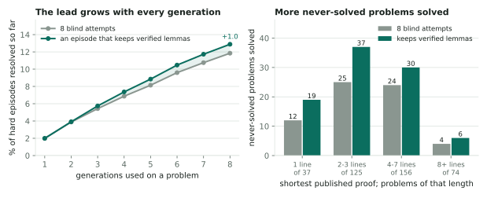

# rlvr-lean

**Reinforcement learning with verifiable rewards for a Lean 4 theorem prover, on one consumer GPU.**

A 7B open prover (DeepSeek-Prover-V1.5) is trained on its own proofs, with the Lean compiler as the only judge
of what counts. A *challenger* picks problems the prover solves about a quarter of the time, a *solver*
attempts them, Lean checks every attempt, and the solver is fine-tuned on what verified. The question the
project asks is narrow and hard: **does this loop take the model to problems it could not solve before, or
does it only make it more reliable on the ones it already could?**

The answer so far, at three seeds and with every read fixed before its run, has two parts. **Training on its
own proofs makes the model more reliable on held-out problems and does not take it further.** What does take
it further is not training at all: **an episode that keeps the steps Lean verified, instead of starting each
attempt from nothing, solves 92 of the never-solved problems where the same number of blind attempts solves
65** (28 gained, 1 lost), 20 of them problems no model here had solved in 558 attempts. Those problems are
reached, not yet reliable. Training on the proofs the episode assembles was tried at one seed and is **not
shown** to help where a proof needs 4 lines or more: once minimised, the assembled proofs are as short as the
model's own. A labelled diagnostic says what limits the loop is what it trains on, not the model: trained once
on other provers' published proofs, the same model solves 245 of the 392 never-solved problems to the base's
59. That is a ceiling measured on borrowed proofs, not a result of the loop.

The repository contains the loop and the full record of results, including the ones that came out negative.
The distributed Lean checking pool built to feed it is a project of its own, [lean-pool](https://github.com/cabloo/lean-pool).

<p align="center"></p>

## Results at a glance

| Stage | Question | Result (three seeds, 95% intervals) |
|---|---|---|
| One round on self-written conjectures | Does a round of RLVR help on held-out problems? | pass@1 up on three held-out sets (+1.0 to +1.8 points, every interval above zero); miniF2F-test pass@32 unchanged (46.3% to 46.3%) |
| Selection ablation | Does a gradient-based "learning progress" score pick better training proofs than a random draw? | No measurable difference, then found **inconclusive**: a pipeline defect meant the score was ranking one token ([below](#a-defect-worth-describing)) |
| Problem pool | How many published answers survive a re-check under a current Lean? | 67,857 of 88,961; 206 problems were published as both proved *and* disproved |
| One round, challenger against random picks | Does aiming at a target pass rate beat a random draw? | Yes on every held-out rung (+1.3, +2.8 and +3.0 points over the random arm). Over all 712 held-out rung problems at once, challenger-trained minus random-trained: +0.0254 in pass rate [+0.0198, +0.0311] (95% bootstrap over problems, three seeds). That is one pooled interval, added after the run; the per-rung figures are the statement about each rung (`ladder-l1-RESULT.md`) |
| Dose curve | Train longer on the same proofs? | A second pass adds 4.0 points on mid-difficulty problems and **loses** ground on never-solved ones (32 gained, 63 lost) |
| Three rounds | Does the ladder climb, and does it reach new problems? | Every rung rises (hardest +2.0 points [+0.7, +3.4]). On 392 never-solved problems the trained model succeeds on 1.5 times as many attempts but solves about the same problems (64 gained, 52 lost, p = 0.31) |
| Equal compute | Is training a better use of 24,000 attempts than plain sampling? | No: the base model given those attempts solves 158 of the never-solved problems against the trained model's 96 |
| Lower reward target | Does aiming the challenger at a pass rate of 1/10 instead of 1/4 keep its picks hard, and does the model reach further? | The picks stay on target. Hardest rung: no difference shown (+0.6 points [−0.4, +1.6]). Never-solved problems: a third more successes per attempt at every seed; more problems solved in one seed of three |
| Repair, no training (one seed, two checks) | Is an attempt that resumes from Lean's proof state better than a fresh one? | One repair step is (2.7% against 1.9% verify on hard problems); a second adds nothing. Over five attempts the lead is +0.5 points [−0.2, +1.2], and the same problems get solved (49 against 47) |
| Accumulating episode, no training | Does an episode that keeps its verified lemmas across 8 generations solve more than 8 blind attempts? | **Yes, at every seed.** Hard episodes resolved: +1.0 points [+0.5, +1.6]. Never-solved problems solved: 92 against 65 (28 gained, 1 lost; as a ratio 1.42 [1.25, 1.64]); where the proof needs 4 lines or more, 36 against 28 (8 gained, 0 lost). The same generations, 91% of the tokens, 1.5 times the Lean checks |
| The same episode, by a replay after the run | What do the blind arm's own 8 attempts get when only the Lean-only assembly is added to them? | At least what the accumulate arm got as run: 1,373 hard episodes resolved against its 1,294 (blind 1,190), and 94 never-solved problems against its 92 (blind 65), with no generation added. Read after the run, not an arm fixed before it (`ladder-l3c-RESULT.md`, addendum) |
| The ceiling, a labelled diagnostic (one seed; **not a result of the loop**) | Trained once on 8,000 published proofs written by other provers, can this model learn to write longer proofs? | Yes. On the never-solved problems that need 4 lines or more: +0.0478 successes per attempt [+0.0380, +0.0584] (50.4 per 1,000 against 2.62). It solves 245 of the 392 against the base's 59, and 106 reliably against 3. The adapters were deleted and the training text is not distributed (`ladder-ceiling-RESULT.md`) |
| Assembly in the round (one seed) | Does training on the proofs the episode assembles reach the problems that need longer proofs? | **Not shown**, with the power to have seen it: −0.00019 successes per attempt [−0.00122, +0.00061] against a twin trained without them. Once minimised, the assembled proofs are as short as the model's own (`ladder-l3d2-RESULT.md`) |
| The loop from a pretrained model (in progress) | Does the loop add anything on top of a model pretrained on published proofs? | Built; the run is in progress; no result yet. Labelled as distillation of other provers followed by the loop (`ladder-loop.spec.md`, L4) |

Every stage was run from a written spec whose pass, fail and void conditions were committed before the run.
The specs and result notes are in [`docs/spec/`](docs/spec/).

## The loop



- **Problems come with a published answer.** A problem is a statement from Lean Workbook or STP together with
  a published proof of it, or of its exact negation, that our own Lean accepts. Nothing the model wrote is in
  the pool, and published proofs are used as certificates only, never as training targets: the solver trains
  only on proofs it found itself. There are two exceptions, each labelled as one wherever it is reported: a
  ceiling diagnostic, and an arm now running that starts from a model pretrained on published proofs (both
  below).
- **Either side counts.** A problem is resolved by proving the statement or by proving its negation, so
  refuting a false statement is rewarded like proving a true one.
- **The challenger's reward** for a problem that `k` of `n` solver attempts resolved, with `p = k/n` and a
  target rate `t`:

  $$r(k) = \frac{p\,(1-p)^{a}}{t\,(1-t)^{a}}, \qquad a = \frac{1}{t} - 1$$

  It is 0 for a problem never solved or always solved, and 1 at the target. With `t = 1/4` and `n = 8` it pays
  0.79, 1.00, 0.87, 0.59 for 1 to 4 successes. There is no difficulty filter anywhere else: difficulty falls
  out of this reward.
- **Held-out measurement.** 2,000 problems are held out before anything is trained. Those the base model
  sometimes solves are cut into three rungs by its pass rate; the 392 it never solved in 32 attempts are the
  *goal set*. Every comparison is paired by problem with fresh samples on both sides, because a problem placed
  as "hard" by a noisy count reads easier the next time with no training at all.

## What the experiments say

### Training makes the model more reliable, on held-out problems, at every difficulty it can already touch

Three rounds, each model trained from the base on all rounds' proofs so far (about 720, 1,470 and 2,190),
lift the pass rate on every held-out rung: by 7.6 points where the base already solves 77% of attempts, by
8.7 where it solves 27%, and by 2.0 [+0.7, +3.4] where it solves 7%. The third round adds nothing that
separates from zero.

### Training alone has not reached problems the base could not solve

<p align="center"></p>

On the goal set, with both models given 93 attempts per problem, the trained model succeeds on 5.4 attempts
per 1,000 against the base's 3.6 (difference +1.8 [+0.6, +3.2]). But those extra successes fall on problems
both models solve: problem by problem it gains 64 and loses 52 (p = 0.31). And charged for its own training
attempts, the loop loses to brute force: the base model, simply sampled three times as much, solves 158 goal
problems to the trained model's 96. This is the same shape the first experiment showed on miniF2F (pass@1 up,
pass@32 flat), one level harder.

### Training longer on the same proofs narrows the model

<p align="center"></p>

Held-out loss says stop after one pass; held-out pass rate on solvable problems says two; the goal set says
one. The three disagree because repeated passes concentrate the model on fewer proof shapes (distinct
attempts fall from 95% to 77%), which helps where it can already win and hurts where a problem needs a rare
attempt. The held-out loss was measuring the narrowing, not the proving.

### The pool has no middle

<p align="center"></p>

For this model, published problems are mostly either out of reach or easy. Of 51,631 candidates, 2,555 are
predicted inside the band the reward aims at and only 718 in its upper half, where the challenger's expected
reward peaks; one round uses those up. After that its picks drift *easier* (mean pass rate 0.37, 0.47, 0.47
over three rounds), the opposite of the intended ladder. Its predictor is calibrated on average but loose
per problem, so an expected-reward maximiser aims above the target. Both effects are properties of the data
and the estimate, not of the reward's shape.

<p align="center"></p>

Refutations of false statements are where the pool's middle is (they are 4% of candidates and 45% of first-
round picks). A quota would fix the share by decree, and a discount on their reward is a switch, not a dial:
20% off leaves 6% of the picks, 30% off leaves none. Left alone, with the challenger refit four times a round so it sees the current solver, the
share falls by itself as the solver learns to refute.

### Aiming the reward lower trains on fewer easy proofs, and that helps where it is hard

<p align="center"></p>

The same three rounds were run again with one setting changed: the reward's target, 1/10 in place of 1/4, so
that its expected-reward peak sits at a quarter instead of above a third. The challenger then stays where it
was aimed (its picks average a pass rate of 0.27, 0.34 and 0.24 over the rounds, against 0.37, 0.47 and 0.47)
and refutations fall to a twentieth of its picks, with no quota.

The measure fixed before the run, the hardest held-out rung, shows no difference (+0.6 points [−0.4, +1.6],
the same sign at each seed). On the never-solved problems the lower target's model succeeds on about a third
more attempts than the other at every seed (7.2 per 1,000 against 5.4; the base 3.6). It solves more of those
problems in one seed of three and exactly as many as the base in the other two, so that is not counted as
reach. It gives up about a point on the easy rung.

What changed is the training set: about as many proofs from problems few solvers cracked (2,486 against
2,601) and about 1,450 fewer from problems most did. Leaving the easy proofs out keeps the model more varied
(90% of its attempts are distinct, against 87%), which is the dose curve's finding from the other side.

### Feeding Lean's answer back: one repair step puts the solver ahead, a second adds nothing

<p align="center"></p>

Everything above is blind resampling: a failed attempt tells the model nothing. Two checks with the untrained
base model asked what happens when it does. A failed proof is cut before its first error, Lean reports the
proof state at the cut, and the model resumes from the kept lines and that state, in the comment format the
prover's authors trained it on. The figure shows running totals, because a per-attempt rate at later attempts
would compare different survivors: the arm that resolved more early is left with the harder episodes.

- **The state is information the model uses.** Resuming with it resolves 2.6 points more hard episodes than
  resuming from the same kept lines without it [+1.3, +3.9].
- **One repair step straight after a failure beats a fresh attempt,** measured twice on separate samples:
  1.9% against 1.1% of 1,880 failures verify, then 2.7% against 1.9% of 6,562.
- **The lead it makes is kept, and it is small.** Within two attempts the repairing episode is ahead by 0.7
  points [+0.1, +1.4]; within five, by 0.5 [−0.2, +1.2] (9.0% of 6,696 hard episodes against 8.5%), which is
  no longer separable from zero. The first check, which resumed after every failure, ends at +0.6 [−1.0, +2.2].
- **A second repair step adds nothing.** On the 6,179 episodes still open in both arms after three attempts,
  it verifies 94 times and a fresh attempt 98. The episodes a repair can fix are taken by the first one; and
  resumed every time, the model rewrites what Lean rejected (46% exact copies by the fifth attempt).
- **Reach does not move.** The same goal problems get solved either way (49 against 47).

The second check was sized to resolve the gain that the first one's data suggested (+1.3 points). It did not
repeat, which is what fixing the read before the run is for.

### What the never-solved problems have in common: they need longer proofs

Reading the stored results by the length of each problem's shortest published proof gave the cause. The
problems the base never solves are not another kind of mathematics: their proofs are a few intermediate facts
and a closing step (median 4 lines, against 1 on the easiest rung). And training helps exactly where a short
proof exists:

| Shortest published proof | Never-solved problems | Base, successes per 1,000 attempts | After three rounds | Ratio |
|---|---|---|---|---|
| 1 line | 37 | 9.5 | 22.9 | 2.4 |
| 2 to 3 lines | 125 | 4.7 | 10.6 | 2.3 |
| 4 to 7 lines | 156 | 2.9 | 3.9 | 1.4 |
| 8 lines or more | 74 | 0.4 | 0.3 | 0.7 |

A proof written in one shot is verified all or nothing, so its chance falls with every step it needs.
Training on the model's own proofs raises the chance of a step it already takes and does not supply the steps
it never takes. Meanwhile the pieces are there and are thrown away: in 58% of failed first attempts on hard
problems, the first error is on the last line, so every step before it had verified, and the next attempt
starts from nothing.

### An episode that keeps what verified reaches problems that sampling does not

<p align="center"></p>

So the episode was changed and the model was not. An episode gets up to 8 generations on a problem and holds a
pool of lemmas that only grows. After each failed proof, its leading `have` steps that Lean accepted are added
to the pool (and checked together); the closing step of a failed proof is kept and tried again whenever the
pool has grown; and a generation either starts fresh or continues from the pool, shown Lean's proof state.
The comparison is 8 blind attempts from the same first attempt, with the same untrained base model, read by
running totals.

- **It resolves more hard episodes at every seed,** +1.1, +1.1 and +0.8 points; over the three, +1.0
  [+0.5, +1.6] (12.9% of 10,044 episodes against 11.8%). The lead grows with every generation, where a repair
  step's lead was made once and held.
- **It solves problems sampling does not.** Of the 392 never-solved problems, 92 against 65 over 18 episodes
  each: 28 gained, 1 lost. 20 of the 92 were never solved by the base model or by any trained model here in
  558 attempts. As a ratio of the counts, 92 / 65 = 1.42 [1.25, 1.64]: 42% more problems, from 25% to 64% (a
  summary added after the run, not a pre-registered read; 95% bootstrap over the 392 problems).
- **The longer proofs move too.** Where the shortest published proof is 4 lines or more: 36 against 28, 8
  gained and none lost (sign test p = 0.008). Most of the gain is still on short-proof problems, the ones
  blind attempts kept nearly solving.
- **The cost is Lean time, not GPU time.** The same number of generations, 91% of the generated tokens, and
  1.5 times the Lean checks, because an assembled proof (the pooled lemmas with a kept closing step) is a
  candidate that cost no generation. Of the 28 gained problems, 23 were won by such a proof.
- **Reached is not reliable.** Of the 28 gained problems, 19 were won in one episode of 18. And the untrained
  model does little with a pool it is shown: three quarters of its continuations go straight to a closing
  tactic, and 27% repeat a proof Lean already rejected.

For scale: the base model with 279 blind attempts a problem solved 82 of these problems, and the models after
three rounds of training, with 279, solved 94. The accumulating episode solves 92 with 144 generations of the
untrained model.

**A replay after the run says which part does the reaching.** The accumulate arm spends about half of its
later generations continuing from the pool, and the untrained model does little with them. So the blind arm's
own eight attempts were replayed with only the episode's Lean-only part added: after each failed attempt its
verified steps go into the pool, the pool is checked, and the kept closing steps are tried again. No
generation is added or changed.

- **Hard episodes resolved within 8 generations, of 10,044:** 1,373, against 1,294 for the accumulate arm as
  run and 1,190 for blind. Paired by problem: +0.0182 [+0.0136, +0.0233] over blind and +0.0079
  [+0.0041, +0.0116] over the accumulate arm.
- **Never-solved problems solved:** 94 (blind 65, accumulate 92). Against blind it gains 29 and loses none, as
  it must, being the same attempts and more candidates; against the accumulate arm it gains 11 and loses 9.
- **Cost:** no generation, and 1.7 times the blind arm's Lean checks.

For the untrained model, then, the continuing generations cost more than they return and the recombination is
what reaches: an episode can stay 8 one-shot attempts with assembly after them. This is a replay read after
the run, not an arm fixed before it; its size against the accumulate arm is one setting's and was not tuned
([`ladder-l3c-RESULT.md`](docs/spec/ladder-l3c-RESULT.md), addendum).

### A ceiling, labelled as one: trained once on other provers' published proofs, the model writes longer proofs

This is a diagnostic and **not a result of the loop**. The loop's rule is that published proofs are
certificates and not training text. As a stated exception to it, the base model was trained **once** on 8,000
published proofs of pool problems it cannot solve: proofs written by other, stronger provers, none of a
held-out problem, one pass with the round's recipe. Both adapters were deleted when the report was written,
and the training text is not distributed with this repository. One seed.

- **The model can learn longer proofs from examples.** On the 230 never-solved problems whose shortest
  published proof is 4 lines or more, over 93 one-shot attempts each, successes per attempt rise by +0.0478
  [+0.0380, +0.0584]: 50.4 per 1,000 attempts against the base's 2.62. The loop's own gain there, the
  reference fixed before the run, is +0.00064.
- **Problems solved.** Of the 392 never-solved problems it solves 245 at least once in 93 attempts, against
  the base's 59. It solves 106 reliably (in at least half of 11 episodes of 8 attempts), against 3 for the
  base and 15 for the loop's three-round model.
- **It is not a leak.** No goal problem's statement is in the training file, and the gain does not rest on
  near variants: on the 123 problems of 4 lines or more whose nearest training statement overlaps under 0.5,
  the difference is +0.0438 [+0.0296, +0.0596]. It does fall as the problems get less like anything trained
  on (+0.0259 [+0.0077, +0.0489] on the 42 under 0.3): learning that carries to problems of the same kind,
  strongest near what was seen, and not a copy.
- **What it says and does not say.** What limits the loop is what it trains on, not the model: with about as
  many examples (2,000 against the loop's 1,685), published proofs of problems it cannot solve take the goal
  set from 4.0 successes per 1,000 attempts to 44.1, and its own proofs take it to 7.2. It does not say the
  loop can get there on its own. These proofs were written by other provers.

([`ladder-ceiling-RESULT.md`](docs/spec/ladder-ceiling-RESULT.md))

### Training on what the episode assembles is not shown to help: the assembled proofs come out short

The loop was then run with the assembly inside the round: six rounds of 1,000 problems at a target rate of
1/10, the Lean-only assembly after every batch, and the proofs it assembles in the training set. After round
six a twin was trained on the same rows in the same order without the 156 assembled proofs, and the two were
measured side by side. One seed.

- **Not shown.** On the 230 never-solved problems of 4 lines or more, the model trained with the assembled
  proofs minus its twin: −0.00019 successes per attempt [−0.00122, +0.00061] (2.66 per 1,000 against 2.85).
- **The run could have seen a gain.** At the ceiling's figure for a published proof, 156 proofs would give
  +0.0020, and this run resolves about ±0.0009.
- **Why: once minimised, an assembled proof is as short as the model's own.** As assembled, the rounds'
  proofs have a median of 7 lines; with the pool blocks the closing step does not need taken out, 3, which is
  the median of the model's own one-shot proofs. Assembly solves problems that have a short proof the model's
  8 attempts did not happen to write whole; it does not make a longer argument.
- **It does not take back the episode.** Assembly still reaches problems at no cost in generations: a search
  step worth keeping in an episode, and not a source of training text that moves one-shot ability.

([`ladder-l3d2-RESULT.md`](docs/spec/ladder-l3d2-RESULT.md))

### In progress: the same six rounds from a model pretrained on published proofs

The ceiling put a decision, and it was answered with both arms. The base arm is the six rounds above. The
other (L4 in the spec) is the same six rounds started from a model pretrained on published proofs, so that
what the loop adds on top of pretraining is itself measured. The pool is cut in two by a hash of each
problem's id: the pretraining reads one half and the rounds draw from the other, so no round draws a problem
whose published proof the pretraining saw. Everything this arm produces is labelled as what it is,
distillation of other provers followed by the loop. It is built; the run is in progress; there is no result
yet ([`ladder-loop.spec.md`](docs/spec/ladder-loop.spec.md), L4).

### A defect worth describing

The first two experiments reported a fourfold drop in held-out loss after one round, and a selection score
that picked no better than chance. Both were one bug. The prover writes a sequence-start token between its
prompt and its proof; the training pairs omitted it. That single position accounted for 97% to 101% of every
measured loss drop and 99.8% of the gradient the selection score was built on. The pass-rate results, which
Lean checked, survived the fix unchanged (+0.99 points against +1.01); the loss-based conclusions were
withdrawn in the result notes, and the loss is now reported by part.

### A published label is not a certificate

Of 140,214 Lean Workbook statements, 206 are published as both proved and disproved, because one source's
"disproved" negates the conclusion while keeping the hypotheses, which is vacuous when the hypotheses
contradict each other. Every certificate is therefore re-checked under the pinned Lean, against the *exact*
negation where it is a disproof. Mathlib's lemma renames since the proofs were published cost another 8,379
certificates, recovered with a 29-entry rename table taken from Mathlib's own deprecation records.

## Engineering

- **Verification is the bottleneck, so it got its own project.** [lean-pool](https://github.com/cabloo/lean-pool) puts HAProxy, a
  shared result cache and per-machine load agents in front of several
  [Kimina Lean Servers](https://github.com/project-numina/kimina-lean-server), with an admission test a
  server must pass before it joins, optional mutual TLS, request priorities and a capacity signal clients
  follow. The experiments ran on 37 Lean workers across four machines at 30 to 50 checks per second.
- **Sampling and checking roll.** The GPU samples in chunks while a finaliser settles blocks as their checks
  return, so neither side waits for the other. Every step is idempotent against a store and resumes at the
  first block not done.
- **A soundness alarm.** A verified proof on the side a published certificate rules out stops the run: either
  the certificate or the checker is wrong.
- **One 16 GB card.** QLoRA on a 4-bit base for training (peak 8.7 GB with gradient checkpointing), vLLM with
  an FP8 export and LoRA adapters for sampling at about 2,500 tokens per second.
- **Statistics.** Paired by problem, bootstrap over problems, sign tests for solved/unsolved flips, one seed
  as a scout and three to conclude, and a distinction kept between a run that failed and an idea that failed.
- **Tests.** About 920 tests for the loop (the pool's 1,100 are in its own repository). The model and Lean are
  replaced by stand-ins, so the suite runs with no GPU and no network. The tests that read the published-proof
  fixtures or the pool's derived data skip here, because neither is distributed.

## Repository layout

```
src/rlvr_lean/
  domain/           pure rules: verification status, the reward and the band, the challenger's
                    predictor, training-set selection, the repair cut, the episode's assembly,
                    estimators (pass@k, bootstrap)
  infrastructure/   the Lean client, the artifact store, the verification service
  gpu/              the steps that run on the GPU (sampling, training, measuring), one process each
  reporting/        the read of each stage, exactly as fixed before its run
  runner/           the stage runner: which steps make a stage, in what order
  tools/            building the problem pool, re-checking certificates, the Lean-version check, the
                    harvest of assembled proofs, the ceiling's and the pretraining's files
  config/           one experiment config
tests/              the specs' fixtures as tests; stand-ins for the model and for Lean
docs/spec/          the specs and the result notes, as written during the project
docs/results/       the result summaries, numbers only; the figures are drawn from them
docs/figures/       the figures and the script that draws them
```

## Running it

```bash
uv run --group dev pytest          # the test suite: no GPU, no network
python docs/figures/make_figures.py   # redraw the figures from docs/results/ (needs matplotlib)
```

The GPU stages need a 16 GB card, a Kimina Lean Server (or [lean-pool](https://github.com/cabloo/lean-pool) in front of several) and the
model weights. A stage is one command, and the stages are listed in
[`src/rlvr_lean/runner/entry.py`](src/rlvr_lean/runner/entry.py); each has a `_smoke` variant that runs on the
shipped fixtures (the ceiling's and the pretraining's need a fixture of published proofs, which is not
distributed), for example
`PYTHONPATH=src python -m rlvr_lean.runner.entry --stage ladder_l1_smoke --profile full --out out/`. The settings are in
[`src/rlvr_lean/config/experiment.yaml`](src/rlvr_lean/config/experiment.yaml). The problem pool is rebuilt
from the published datasets with `python -m rlvr_lean.tools.ladder_pool` (it is not shipped: 30 MB derived
from Lean Workbook and STP). The one data file that is shipped,
[`heldout_proof_lines.jsonl`](src/rlvr_lean/data/ladder_l0/heldout_proof_lines.jsonl), holds the held-out
problems' ids and the line count of each one's shortest published proof, which the reports group by; it holds
no statement and no proof. No training text made of other people's published proofs is distributed: the
ceiling's file and the pretraining file are built from the pool by `python -m rlvr_lean.tools.ladder_ceiling_set`.

## Status

Training on one-shot proofs makes the prover more reliable on what it can already sometimes do. Reach came
from the search: an episode that keeps what verified solves problems that sampling does not, with an untrained
model. Training on what that search assembles is not shown to add to it, and the loop's own training has
barely moved the problems whose proof needs 4 lines or more (+0.00064 successes per attempt over three
seeds); the one thing measured that moves them is training on proofs written by stronger provers, which is a
ceiling and not the loop's doing. None of this is yet the aim, which is to do reliably what could not be done
before. Three things are open.

- **The loop on top of pretraining (in progress).** The same six rounds from a model pretrained on published
  proofs, on a half of the pool the pretraining never saw, asks whether the loop takes that model to problems
  it could not solve. It is labelled as distillation of other provers followed by the loop. No result yet.
- **A search that builds longer arguments.** The assembled proofs are recombinations of failed attempts and
  come out short. Lemmas proposed for a goal are another thing, and are not built.
- **A deeper pool.** About 650,000 published proofs have not been re-checked yet; the pool's thin middle is
  the scarcest thing the loop has.

## Credits

Research direction and decisions: Zane Hooper. The code, the experiment runs and the result notes were
produced with [Claude Code](https://claude.com/claude-code), working from written specs with reads fixed
before each run; the notes in `docs/spec/` are kept as they were written, with machine names removed.

Built on [DeepSeek-Prover-V1.5](https://github.com/deepseek-ai/DeepSeek-Prover-V1.5),
[Lean 4](https://lean-lang.org/) and [Mathlib](https://github.com/leanprover-community/mathlib4),
[Kimina Lean Server](https://github.com/project-numina/kimina-lean-server),
[Lean Workbook](https://huggingface.co/datasets/internlm/Lean-Workbook),
[Goedel-Prover's proofs](https://huggingface.co/datasets/Goedel-LM/Lean-workbook-proofs),
[STP](https://huggingface.co/datasets/kfdong/STP_Lean_0320), [vLLM](https://github.com/vllm-project/vllm) and
[PEFT](https://github.com/huggingface/peft).
