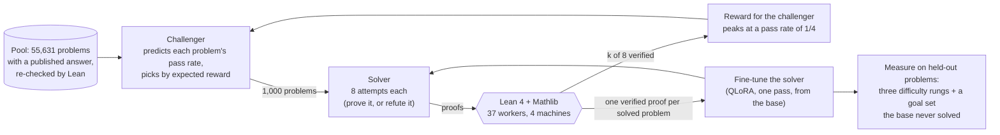

# rlvr-lean

**Reinforcement learning with verifiable rewards for a Lean 4 theorem prover, on one consumer GPU.**

A 7B open prover (DeepSeek-Prover-V1.5) is trained on its own proofs, with the Lean compiler as the only judge
of what counts. A *challenger* picks problems the prover solves about a quarter of the time, a *solver*
attempts them, Lean checks every attempt, and the solver is fine-tuned on what verified. The question the
project asks is narrow and hard: **does this loop take the model to problems it could not solve before, or
does it only make it more reliable on the ones it already could?**

The answer so far, at three seeds and with every read fixed before its run: **more reliable, measurably and
on held-out problems; not yet further.** The repository contains the loop, the distributed Lean checking pool
built to feed it, and the full record of results, including the ones that came out negative.

<p align="center"></p>

## Results at a glance

| Stage | Question | Result (three seeds, 95% intervals) |
|---|---|---|
| One round on self-written conjectures | Does a round of RLVR help on held-out problems? | pass@1 up on three held-out sets (+1.0 to +1.8 points, every interval above zero); miniF2F-test pass@32 unchanged (46.3% to 46.3%) |
| Selection ablation | Does a gradient-based "learning progress" score pick better training proofs than a random draw? | No measurable difference, then found **inconclusive**: a pipeline defect meant the score was ranking one token ([below](#a-defect-worth-describing)) |
| Problem pool | How many published answers survive a re-check under a current Lean? | 67,857 of 88,961; 206 problems were published as both proved *and* disproved |
| One round, challenger against random picks | Does aiming at a target pass rate beat a random draw? | Yes on every held-out rung (+1.3, +2.8 and +3.0 points over the random arm) |
| Dose curve | Train longer on the same proofs? | A second pass adds 4.0 points on mid-difficulty problems and **loses** ground on never-solved ones (32 gained, 63 lost) |
| Three rounds | Does the ladder climb, and does it reach new problems? | Every rung rises (hardest +2.0 points [+0.7, +3.4]). On 392 never-solved problems the trained model succeeds on 1.5 times as many attempts but solves about the same problems (64 gained, 52 lost, p = 0.31) |
| Equal compute | Is training a better use of 24,000 attempts than plain sampling? | No: the base model given those attempts solves 158 of the never-solved problems against the trained model's 96 |

Every stage was run from a written spec whose pass, fail and void conditions were committed before the run.
The specs and result notes are in [`docs/spec/`](docs/spec/).

## The loop



- **Problems come with a published answer.** A problem is a statement from Lean Workbook or STP together with
  a published proof of it, or of its exact negation, that our own Lean accepts. Nothing the model wrote is in
  the pool, and published proofs are used as certificates only, never as training targets: the solver trains
  only on proofs it found itself.
- **Either side counts.** A problem is resolved by proving the statement or by proving its negation, so
  refuting a false statement is rewarded like proving a true one.
- **The challenger's reward** for a problem that `k` of `n` solver attempts resolved, with `p = k/n` and a
  target rate `t`:

  $$r(k) = \frac{p\,(1-p)^{a}}{t\,(1-t)^{a}}, \qquad a = \frac{1}{t} - 1$$

  It is 0 for a problem never solved or always solved, and 1 at the target. With `t = 1/4` and `n = 8` it pays
  0.79, 1.00, 0.87, 0.59 for 1 to 4 successes. There is no difficulty filter anywhere else: difficulty falls
  out of this reward.
- **Held-out measurement.** 2,000 problems are held out before anything is trained. Those the base model
  sometimes solves are cut into three rungs by its pass rate; the 392 it never solved in 32 attempts are the
  *goal set*. Every comparison is paired by problem with fresh samples on both sides, because a problem placed
  as "hard" by a noisy count reads easier the next time with no training at all.

## What the experiments say

### Training makes the model more reliable, on held-out problems, at every difficulty it can already touch

Three rounds, each model trained from the base on all rounds' proofs so far (about 720, 1,470 and 2,190),
lift the pass rate on every held-out rung: by 7.6 points where the base already solves 77% of attempts, by
8.7 where it solves 27%, and by 2.0 [+0.7, +3.4] where it solves 7%. The third round adds nothing that
separates from zero.

### It has not yet reached problems the base could not solve

<p align="center"></p>

On the goal set, with both models given 93 attempts per problem, the trained model succeeds on 5.4 attempts
per 1,000 against the base's 3.6 (difference +1.8 [+0.6, +3.2]). But those extra successes fall on problems
both models solve: problem by problem it gains 64 and loses 52 (p = 0.31). And charged for its own training
attempts, the loop loses to brute force: the base model, simply sampled three times as much, solves 158 goal
problems to the trained model's 96. This is the same shape the first experiment showed on miniF2F (pass@1 up,
pass@32 flat), one level harder.

### Training longer on the same proofs narrows the model

<p align="center"></p>

Held-out loss says stop after one pass; held-out pass rate on solvable problems says two; the goal set says
one. The three disagree because repeated passes concentrate the model on fewer proof shapes (distinct
attempts fall from 95% to 77%), which helps where it can already win and hurts where a problem needs a rare
attempt. The held-out loss was measuring the narrowing, not the proving.

### The pool has no middle

<p align="center"></p>

For this model, published problems are mostly either out of reach or easy. Of 51,631 candidates, 2,555 are
predicted inside the band the reward aims at and only 718 in its upper half, where the challenger's expected
reward peaks; one round uses those up. After that its picks drift *easier* (mean pass rate 0.37, 0.47, 0.47
over three rounds), the opposite of the intended ladder. Its predictor is calibrated on average but loose
per problem, so an expected-reward maximiser aims above the target. Both effects are properties of the data
and the estimate, not of the reward's shape.

<p align="center"></p>

Refutations of false statements are where the pool's middle is (they are 4% of candidates and 45% of first-
round picks). A quota would fix the share by decree, and a discount on their reward is a switch, not a dial:
20% off leaves 6% of the picks, 30% off leaves none. Left alone, with the challenger refit four times a round so it sees the current solver, the
share falls by itself as the solver learns to refute.

### A defect worth describing

The first two experiments reported a fourfold drop in held-out loss after one round, and a selection score
that picked no better than chance. Both were one bug. The prover writes a sequence-start token between its
prompt and its proof; the training pairs omitted it. That single position accounted for 97% to 101% of every
measured loss drop and 99.8% of the gradient the selection score was built on. The pass-rate results, which
Lean checked, survived the fix unchanged (+0.99 points against +1.01); the loss-based conclusions were
withdrawn in the result notes, and the loss is now reported by part.

### A published label is not a certificate

Of 140,214 Lean Workbook statements, 206 are published as both proved and disproved, because one source's
"disproved" negates the conclusion while keeping the hypotheses, which is vacuous when the hypotheses
contradict each other. Every certificate is therefore re-checked under the pinned Lean, against the *exact*
negation where it is a disproof. Mathlib's lemma renames since the proofs were published cost another 8,379
certificates, recovered with a 29-entry rename table taken from Mathlib's own deprecation records.

## Engineering

- **Verification is the bottleneck, so it got its own project.** [`lean_pool/`](lean_pool/) puts HAProxy, a
  shared result cache and per-machine load agents in front of several
  [Kimina Lean Servers](https://github.com/project-numina/kimina-lean-server), with an admission test a
  server must pass before it joins, optional mutual TLS, request priorities and a capacity signal clients
  follow. The experiments ran on 37 Lean workers across four machines at 30 to 50 checks per second.
- **Sampling and checking roll.** The GPU samples in chunks while a finaliser settles blocks as their checks
  return, so neither side waits for the other. Every step is idempotent against a store and resumes at the
  first block not done.
- **A soundness alarm.** A verified proof on the side a published certificate rules out stops the run: either
  the certificate or the checker is wrong.
- **One 16 GB card.** QLoRA on a 4-bit base for training (peak 8.7 GB with gradient checkpointing), vLLM with
  an FP8 export and LoRA adapters for sampling at about 2,500 tokens per second.
- **Statistics.** Paired by problem, bootstrap over problems, sign tests for solved/unsolved flips, one seed
  as a scout and three to conclude, and a distinction kept between a run that failed and an idea that failed.
- **Tests.** About 700 tests for the loop and 1,100 for the pool. The model and Lean are replaced by stand-ins, so both
  suites run with no GPU and no network.

## Repository layout

```
src/rlvr_lean/
  domain/           pure rules: verification status, the reward and the band, the challenger's
                    predictor, training-set selection, estimators (pass@k, bootstrap)
  infrastructure/   the Lean client, the artifact store, the verification service
  gpu/              the steps that run on the GPU (sampling, training, measuring), one process each
  reporting/        the read of each stage, exactly as fixed before its run
  runner/           the stage runner: which steps make a stage, in what order
  tools/            building the problem pool, re-checking certificates, the Lean-version check
  config/           one experiment config
lean_pool/          the Lean checking pool (its own README, tests and licence)
tests/              the specs' fixtures as tests; stand-ins for the model and for Lean
docs/spec/          the specs and the result notes, as written during the project
docs/results/       the result summaries the figures are drawn from
docs/figures/       the figures and the script that draws them
```

## Running it

```bash
uv run --group dev pytest          # the test suite: no GPU, no network
python docs/figures/make_figures.py   # redraw the figures from docs/results/ (needs matplotlib)
```

The GPU stages need a 16 GB card, a Kimina Lean Server or a `lean_pool` in front of several, and the model
weights. A stage is one command, and the stages are listed in
[`src/rlvr_lean/runner/entry.py`](src/rlvr_lean/runner/entry.py); each has a `_smoke` variant that runs on the
shipped fixtures, for example
`PYTHONPATH=src python -m rlvr_lean.runner.entry --stage ladder_l1_smoke --profile full --out out/`. The settings are in
[`src/rlvr_lean/config/experiment.yaml`](src/rlvr_lean/config/experiment.yaml). The problem pool is rebuilt
from the published datasets with `python -m rlvr_lean.tools.ladder_pool` (it is not shipped: 30 MB derived
from Lean Workbook and STP).

## Status

Two follow-ups are running: the same three rounds with the reward aimed lower (the estimate's looseness makes
a target of 1/4 steer at 0.35), and a first check of *repair*, where a failed proof is cut at its first
error, Lean reports the proof state there and the model resumes from it. Every measurement above is blind
resampling: a failed attempt tells the model nothing. Repair is the change most likely to move what the
solver can reach.

## Credits

Research direction and decisions: Zane Hooper. The code, the experiment runs and the result notes were
produced with [Claude Code](https://claude.com/claude-code), working from written specs with reads fixed
before each run; the notes in `docs/spec/` are kept as they were written, with machine names removed.

Built on [DeepSeek-Prover-V1.5](https://github.com/deepseek-ai/DeepSeek-Prover-V1.5),
[Lean 4](https://lean-lang.org/) and [Mathlib](https://github.com/leanprover-community/mathlib4),
[Kimina Lean Server](https://github.com/project-numina/kimina-lean-server),
[Lean Workbook](https://huggingface.co/datasets/internlm/Lean-Workbook),
[Goedel-Prover's proofs](https://huggingface.co/datasets/Goedel-LM/Lean-workbook-proofs),
[STP](https://huggingface.co/datasets/kfdong/STP_Lean_0320), [vLLM](https://github.com/vllm-project/vllm) and
[PEFT](https://github.com/huggingface/peft).

`lean_pool/` is MIT-licensed (see its `LICENSE`).
